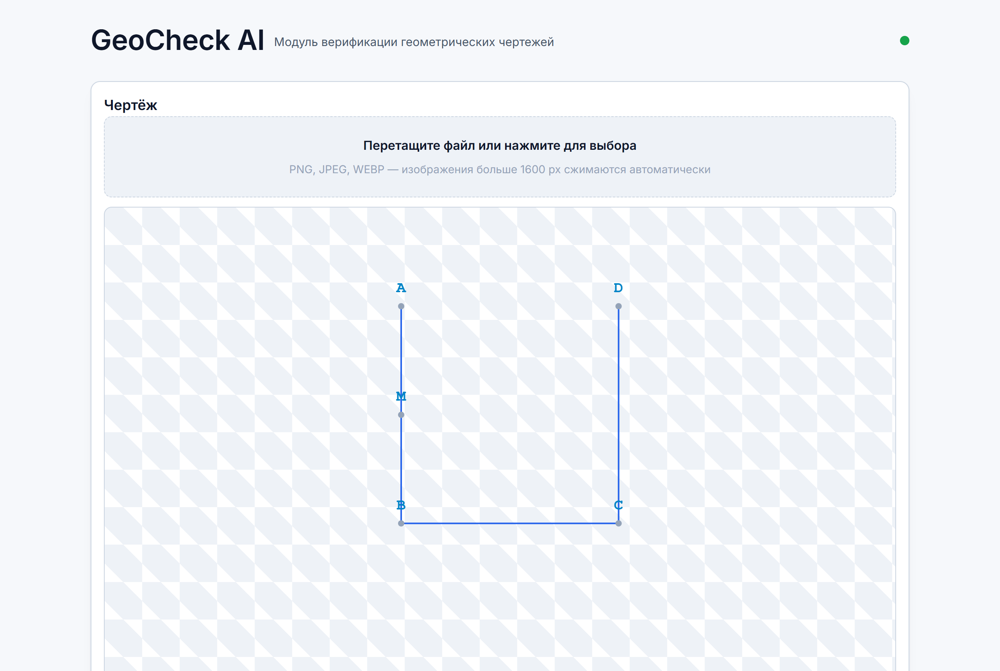

# GeoCheck AI

> Модуль верификации геометрических чертежей — загрузи чертёж, вставь текст задачи; правила распознаются автоматически, подтверди и получи вердикт.

Автоматическая проверка соответствия растрового чертежа текстовым геометрическим условиям задачи: текст задачи → правила (оффлайн-парсер — основной путь, Gemini — ручной фолбэк) → детекция отрезков → дедупликация → OCR-метки вершин → сборка графа → **верификация всех правил** инвариантами аналитической геометрии. Всё работает **в браузере** (WASM) — без сервера и без базы данных.



## Возможности

- **Вход = изображение + текст задачи** — чертёж перетаскивается в зону загрузки, текст вставляется в textarea
- **Текст → правила** — оффлайн-парсер распознаёт правила из текста (основной путь, покрыт юнит-тестами); при ошибке парсера — ручной фолбэк через Gemini (ключ вводится в UI-поле и **не сохраняется вообще** — живёт только в памяти вкладки; в репозитории ключей нет)
- **Human-in-the-loop** — правила всегда проходят подтверждение пользователя: предпросмотр → кнопка «Подтвердить и проверить»
- **Верификация всех правил** — 4 инварианта с погрешностью ε (по умолчанию 3.0, ползунок): перпендикулярность, параллельность, равенство отрезков, принадлежность точки отрезку
- **Детекция линий** (OpenCV.js) — отрезки любой ориентации, min длина 30 px
- **Дедупликация** — кластеризация (разность углов ≤ 5°, расстояние ≤ 7 px) + слияние кластера в отрезок по двум самым удалённым точкам
- **OCR** (Tesseract.js) — одиночные латинские буквы A–Z (UPPERCASE) с координатами центров
- **Граф** — вершины = пересечения поддерживающих прямых, привязка буквы к ближайшей вершине (≤ 40 px)
- **Мягкие ошибки** — `[Status: Error] Точка X не найдена на чертеже` или `[Status: Error] На чертеже не найдено отрезков` вместо падений
- **Производительность** — изображения больше 1600 px по длинной стороне сжимаются перед анализом; время стадий показывается в вердикте

## Стек

| Слой       | Выбор                         | Зачем                              |
| ---------- | ----------------------------- | ---------------------------------- |
| Приложение | Vite + TypeScript (vanilla)   | минимум зависимостей, всё локально |
| CV         | OpenCV.js (WASM)              | детекция отрезков                  |
| OCR        | Tesseract.js (WASM)           | одиночные буквы A–Z                |
| Тесты      | Vitest 4                      | TDD пайплайна (`src/pipeline/*`)   |
| Качество   | TS strict · oxlint · Prettier | локальные гейты                    |

## Быстрый старт

Требования: Node ≥ 22, pnpm.

```bash
pnpm install
pnpm dev           # http://localhost:5173
pnpm test          # Vitest (пайплайн)
pnpm typecheck     # tsc --noEmit
pnpm build         # → dist/
pnpm preview       # локальный сервер собранного dist/
pnpm qa            # build + live-QA UI (headless Chrome, dist/)
pnpm qa:testdata   # build + acceptance-корпус testdata/ (4 связки, ε=10)
pnpm qa:all        # build + обе QA-сюиты подряд
```

## Как это работает: текст → правила → проверка

1. **Загрузка чертежа** — PNG/JPG перетаскивается в зону загрузки; перед анализом большие изображения сжимаются (≤ 1600 px по длинной стороне).
2. **Текст задачи** — вставляется в textarea; например `∠ABC = 90°, AB ∥ CD, AB = CD, точка M лежит на отрезке AB`.
3. **Предпросмотр правил** — на каждый ввод текста оффлайн-парсер выводит распознанные правила (угол, параллельность, равенство отрезков, принадлежность точки отрезку). Если парсер не справился — раскрывается секция ручного фолбэка с Gemini (нужен свой API-ключ; уточнение правил — только вручную; ключ не сохраняется вообще — живёт только в памяти вкладки).
4. **Подтверждение** — кнопка «Подтвердить и проверить»: правила фиксируются, запускается пайплайн (детекция → дедупликация → OCR → граф) и верификация всех правил на построенном графе.
5. **Вердикт** — чеклист с итогом по каждому правилу и общим результатом; мягкие ошибки вместо падений, если точка/правило не применимы. Ползунок ε и смена текста пересчитывают вердикт без повторного OCR.

## Честные ограничения

- **ε корпуса = 10.** Чертежи в `testdata/` нарисованы неточно: измеренные отклонения на «true»-чертежах ~5–9.5° / ~5–8 px, поэтому acceptance-прогон (`pnpm qa:testdata`) выставляет ε=10 — максимум ползунка. Дефолт ТЗ 3.0 в UI не менялся.
- **Абсолютные длины отрезков не верифицируются** — правила работают через углы, параллельность и принадлежность точек, не через пиксельные длины.
- **Полный анализ ~3–5 s на CPU** — включая refine-проход OCR для непомеченных вершин; жёсткого бюджета времени в ТЗ нет, тайминги стадий показываются в вердикте.

## OCR-дружелюбные чертежи

- Метки — чёрные/тёмные латинские буквы (высота глифа ≥ 24 px); центр метки — не дальше 40 px от вершины (после даунскейла); штрихи меток короче 30 px, чтобы не создавать ложные вершины
- Линии — светло-серые (например "#b0b0b0"): бинаризация OCR их отбрасывает, а Canny детектирует

## Структура

```
index.html                  # вход SPA
src/
  main.ts                   # bootstrap приложения
  styles.css                # дизайн-токены (context/ui-tokens.md)
  ui/                       # компоненты интерфейса (Phase 1+)
  pipeline/                 # чистые функции пайплайна (TDD, Vitest)
    types.ts  constants.ts  # доменные типы и пороги из ТЗ
    lines.ts  dedup.ts  ocr.ts  graph.ts  verify.ts  run.ts  scale.ts  opencv-interop.ts
    ocr-prep.ts  ocr-refine.ts  rules/   # OCR-подготовка/refine, текст→правила
scripts/qa/                 # live-QA харнессы (ui-shell, testdata, probe)
context/                    # авторитетные доки для ИИ-агентов
docs/superpowers/plans/     # планы фич (skills: writing-plans)
public/                     # статика (tessdata при необходимости)
```

## Документация

`context/…` — авторитетные продуктовые и инженерные доки (бриф, обзор, архитектура, план билда, трекер, дизайн-токены). `AGENTS.md` / `.clinerules` описывают рабочий процесс ИИ-разработки, перенесённый из проекта cost-guard-ai и адаптированный под это ТЗ. Исходное ТЗ — `product-brief.md` (единый источник правды).

Проект разработан ИИ-агентом под управлением этого харнесса, и он намеренно остаётся в репозитории: планы фич — `docs/superpowers/plans/`, журнал сессий агента — `memory.md` и `skill-observations/`, вендоренные скиллы — `.agents/` и `.claude/`, live-QA (headless Chrome) — `scripts/qa/`.

## Лицензия

MIT.
